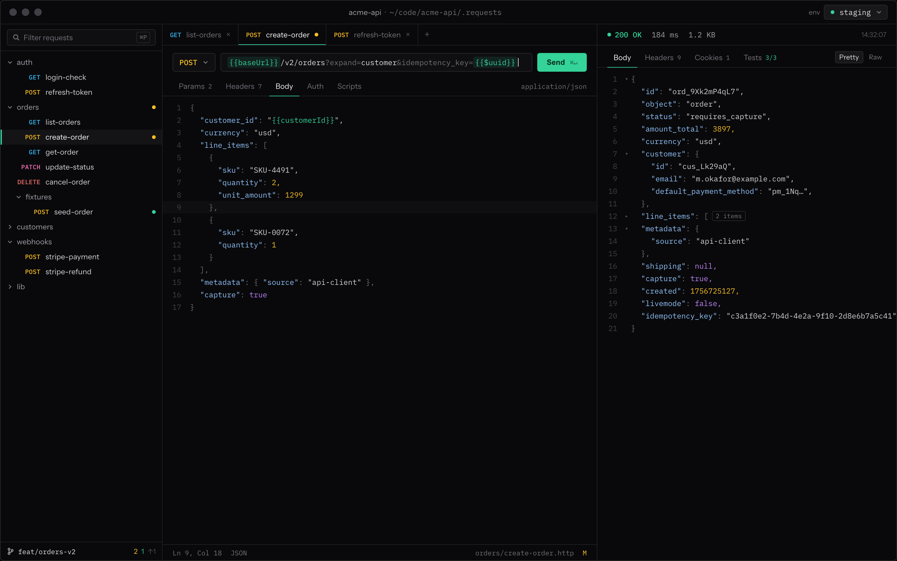
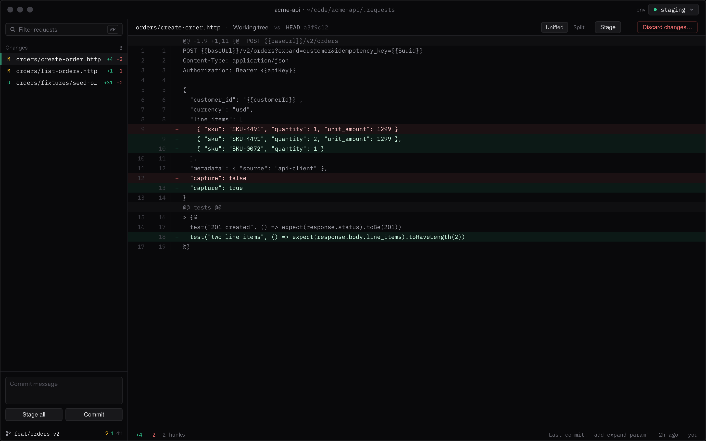
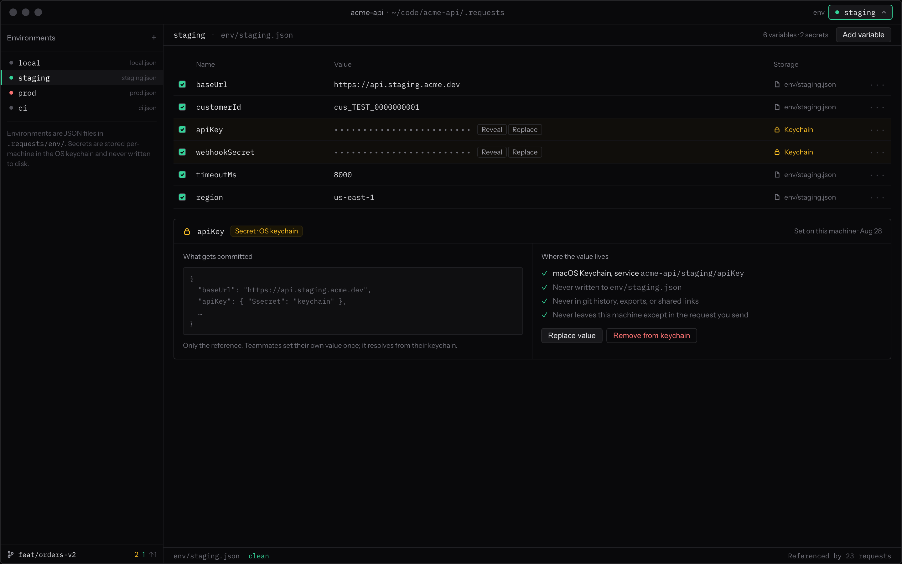
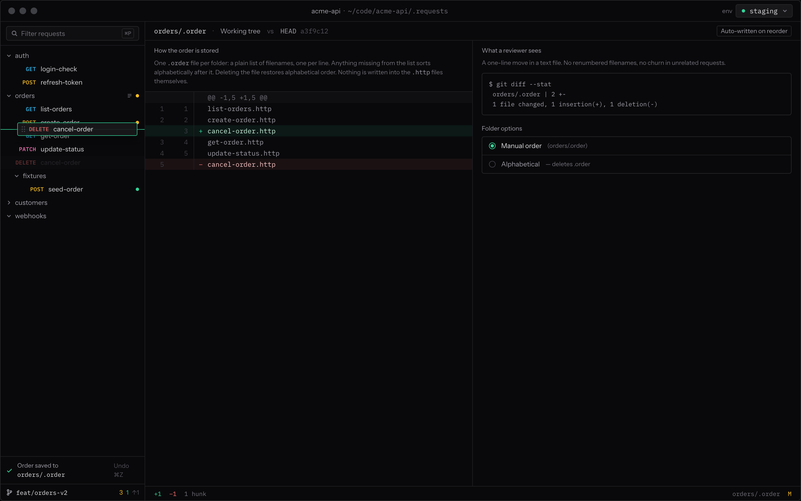
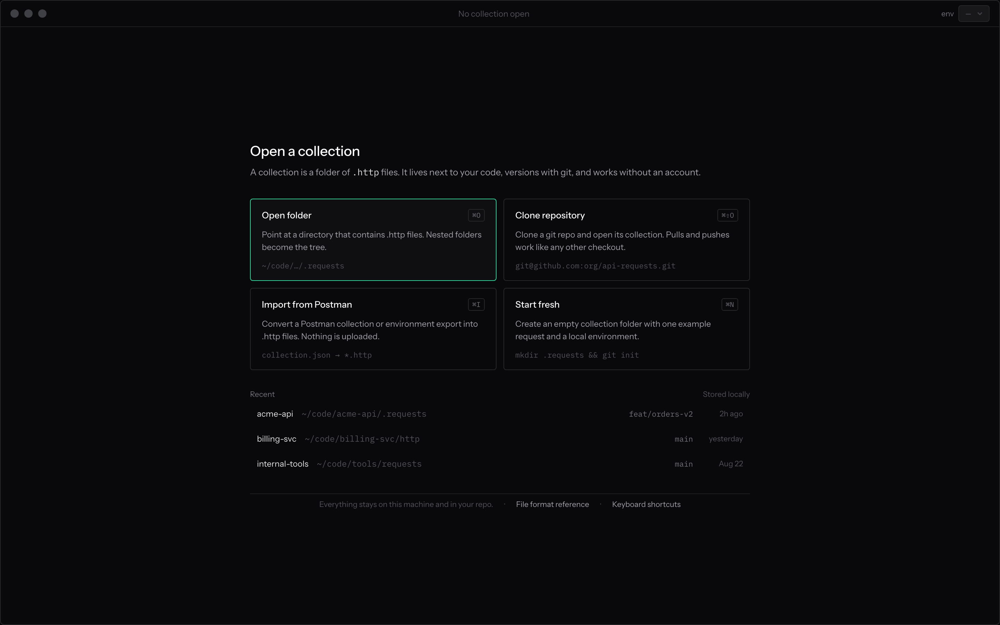
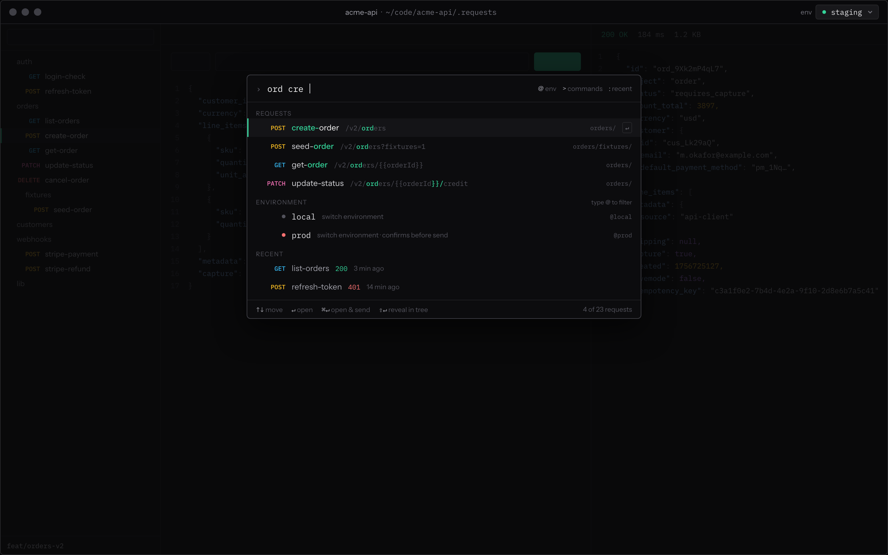
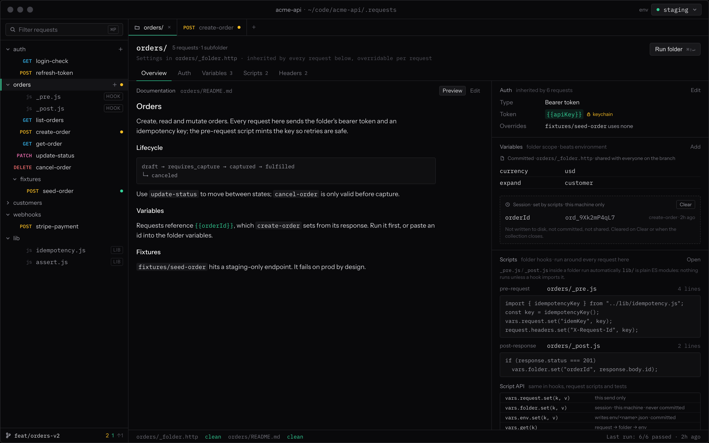
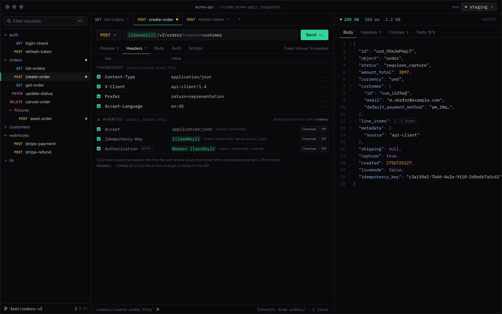
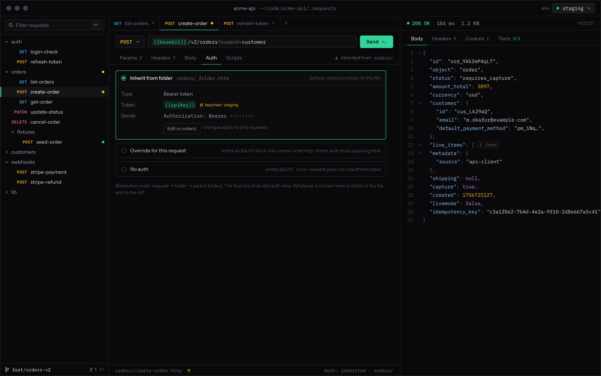

# Otis — screens

One section per artboard in the design document. Each names the screen's ID
(the anchor used in the design canvas), the Otis phase it belongs to, what is
on it, and the interactions the static design implies but cannot show.

Phases are from the Phase A–E plan: **B** shell (three-pane layout, tab bar,
live tree), **C** core loop (request editor, send, response, environments),
**D** what makes it Otis (git diff, folder view, scripts, palette, reorder).

PNGs are in [`screens/`](screens/), rendered at 2× from a 1440×900 artboard.

The design's example collection is `acme-api`, rooted at
`~/code/acme-api/.requests`, on branch `feat/orders-v2`, with the `staging`
environment active. Ten of the fourteen tree rows are the `orders/` folder and
its requests. Design values are in [DESIGN-NOTES.md](DESIGN-NOTES.md).

---

## Chrome shared by every screen

Seven of the nine screens share the same frame, so it is described once here.

- **Title bar**, 38px. macOS traffic lights at the left in a 52px slot.
  Centered: collection name in `--fg-muted` sans, a `·`, and the collection
  path in mono. At the right: the label `env` and the environment chip
  (accent dot, environment name in mono, chevron).
- **Sidebar**, 260px. A filter input with a `⌘P` hint, the request tree, and a
  git footer (branch icon, branch name in mono, then modified count in amber,
  untracked count in accent, and `↑1` ahead in `--fg-faint`).
- **Status bar**, 26px, at the bottom of the center pane. Mono, 11px,
  `--fg-dim`. Left is the current file and its git state; right is a one-line
  summary of the current view.

Screen 2b (empty state) has the title bar but no sidebar. Screen 1c replaces
the request tree with an environment list.

---

## 1a · Main view

**Name:** Main view · request loaded · 200 OK
**Phase:** C, sitting in the B shell. This is the screen the whole app is
arranged around.

The three-pane layout at rest. Sidebar tree, center request editor, 480px
response pane.

- **Tree** shows four top-level folders (`auth`, `orders`, `customers`,
  `webhooks`) plus `lib`, with `orders` expanded and `fixtures` nested inside
  it. `create-order` is selected: `--bg-selected` fill and a 2px accent left
  edge. `orders` and `create-order` carry amber modified dots;
  `fixtures/seed-order` carries an accent untracked dot. `customers` and `lib`
  are collapsed (chevron unrotated).
- **Document tabs**, three of them: `GET list-orders` and `POST refresh-token`
  inactive with a `×`, `POST create-order` active with an accent underline and
  an amber dirty dot *in place of* the `×`. A `+` follows.
- **URL bar**: method selector showing `POST` in amber, then the URL field
  with `{{baseUrl}}` and `{{$uuid}}` rendered as accent tokens on a wash while
  the literal path and query values are plain, then the Send button with a
  `⌘↵` hint.
- **Request sub-tabs**: Params 2, Headers 7, **Body**, Auth, Scripts, with
  `application/json` right-aligned on the same strip.
- **Body editor**: 17 lines of JSON with a 44px line-number gutter. Line 9 has
  a `--bg-inset` current-line highlight.
- **Response pane**: `200 OK` with an accent dot, `184 ms`, `1.2 KB`, and
  `14:32:07` right-aligned. Sub-tabs Body / Headers 9 / Cookies 1 / Tests 3/3
  (the tests count in accent), plus a Pretty/Raw segmented control. The body
  has a 40px gutter, a 14px fold column with `▾`/`▸`, and a collapsed
  `line_items` row showing a `2 items` chip.
- **Status bar**: `Ln 9, Col 18` · `JSON` … `orders/create-order.http` `M`.

**Implied but not shown:** cursor movement and editing in the body; expanding
and collapsing response nodes; the Pretty/Raw switch; tab close, reorder and
overflow; tree selection and disclosure; hover states (the tree defines
`--bg-control` on hover, the response defines `--bg-inset`); what Send does
while in flight; the method selector's menu.

---

## 1b · Git diff

**Name:** Git diff · working tree vs HEAD · unified
**Phase:** D

The sidebar switches from the tree to a **Changes** list, and the center pane
becomes a diff viewer. The response pane is gone; the diff takes the full
width beside the sidebar.

- **Changes list**, 3 entries, each a status letter (`M` amber, `U` accent), a
  mono path, and `+n` / `−n` counts in accent and red.
  `orders/create-order.http` is selected.
- Below it a 56px commit message box and two buttons, `Stage all` and
  `Commit`.
- **Diff header**: file path, `Working tree` vs `HEAD a3f9c12`, a
  Unified/Split segmented control, a `Stage` button, a vertical rule, and
  `Discard changes…` in red on a `#3f1d1d` border.
- **Diff body**: two 44px gutters (old line, new line) separated by a rule, a
  24px sign column, then the text. Added lines are `#d1fae5` on an accent
  wash, removed are `#fecaca` on a red wash, hunk headers are `--fg-dim` on
  `--bg-inset`. Two hunks: a JSON body change and a `@@ tests @@` hunk adding
  a test line inside a `> ` block.
- **Status bar**: `+4 −2 · 2 hunks` … `Last commit: "add expand param" · 2h ago
  · you`.

**Implied but not shown:** the Split view; staging a file or a hunk; the
confirmation behind `Discard changes…`; what committing does; how you get
into and out of this view; whether the diff is scrollable per hunk.

Note the diff is of a `.http` file and reads as ordinary text — the point the
whole product is arguing.

---

## 1c · Environment editor

**Name:** Environment editor · keychain-backed secret
**Phase:** C

- **Sidebar** lists environments instead of requests: `local`, `staging`
  (selected), `prod`, `ci`. Each has a status dot — accent for the active one,
  red for `prod`, `--fg-faint` for the others — a mono name, and the file
  name. Below, a note: environments are JSON in `.requests/env/`, secrets live
  in the OS keychain and are never written to disk.
- **Header**: `staging` · `env/staging.json`, `6 variables · 2 secrets`, and
  an `Add variable` button.
- **Variable table**, 5 columns (`28px 220px 1fr 120px 60px`), 36px rows:
  checkbox, name, value, storage, `···`. `apiKey` and `webhookSecret` show
  masked values with `letter-spacing: 2px`, a `Reveal` and a `Replace` chip, an
  amber lock icon and `Keychain` as storage, on a faint amber row tint. Plain
  variables show their value and a file icon with `env/staging.json`.
- **Secret detail panel** for `apiKey`, split in two. Left, "What gets
  committed" with the literal JSON that lands in the file:
  `"apiKey": { "$secret": "keychain" }`. Right, "Where the value lives": four
  accent checkmarks stating the keychain service is
  `acme-api/staging/apiKey`, and that the value is never in the JSON, never in
  git history or exports, and never leaves the machine except in the request.
  Two buttons: `Replace value` and `Remove from keychain` (red).
- **Status bar**: `env/staging.json` `clean` … `Referenced by 23 requests`.

**Implied but not shown:** Reveal's confirmation or timeout; adding, renaming
and deleting variables; converting a plain variable to a secret; what happens
when a teammate opens a collection whose secret is not in their keychain;
creating a new environment (`+`); the environment chip's open menu (§9.11 of
DESIGN-NOTES).

The keychain service string `acme-api/staging/apiKey` matches the implemented
`secrets.Key(collection, env, name)` exactly.

---

## 2a · Manual ordering

**Name:** Manual ordering · drag in tree · persisted as an order file
**Phase:** D

A drag is in progress in the sidebar while the center pane explains and
previews the resulting diff.

- **Tree mid-drag**: `cancel-order` is the source row, dimmed to `opacity: .4`
  on `--bg-inset` with `--fg-faint` text. `get-order` is the drop target with
  a 1px accent top border. A 216×24 drag ghost floats over the tree with a
  6-dot grip glyph, a red `DELETE` label, and `cancel-order` in
  `--fg-emphasis`. Folders with a manual order carry a small list glyph.
- Below the tree, a confirmation strip: an accent check and "Order saved to
  `orders/.order`", with `Undo ⌘Z` at the right.
- **Center pane, left half**: "How the order is stored" — one `.order` file
  per folder, a plain list of filenames one per line, unlisted entries sort
  alphabetically after, deleting the file restores alphabetical order, and
  nothing is written into the `.http` files. Below it the actual diff of
  `orders/.order`: one line added, one removed.
- **Right half**: "What a reviewer sees" — a `git diff --stat` block showing
  `orders/.order | 2 +-`, `1 file changed, 1 insertion(+), 1 deletion(-)`.
  Below, a **Folder options** radio group: `Manual order (orders/.order)`
  selected, `Alphabetical — deletes .order`.
- **Header** notes `Auto-written on reorder`; **status bar** shows `+1 −1 · 1
  hunk`.

**Implied but not shown:** the drag interaction itself (grab affordance,
auto-scroll, dropping into a different folder, whether folders and requests
can interleave); what `Undo ⌘Z` reverts (the file write, the tree state, or
both); whether switching to Alphabetical prompts before deleting `.order`.

The described semantics match `FORMAT.md` §2.2 exactly, including "never
rewritten on add".

---

## 2b · Empty state

**Name:** First launch · no collection open
**Phase:** B

No sidebar, no panes. The title bar shows `No collection open` and a disabled
environment chip showing `—`. A single 720px centered column.

- **Headline** "Open a collection" at 20px, then: "A collection is a folder of
  `.http` files. It lives next to your code, versions with git, and works
  without an account."
- **Four starter cards** in a 2×2 grid, each with a title, a keyboard hint, a
  description, and a mono example. The first is outlined in the accent; the
  rest in `--border-control`.
  1. **Open folder** `⌘O` — point at a directory containing `.http` files;
     nested folders become the tree. `~/code/…/.requests`
  2. **Clone repository** `⌘⇧O` — clone a git repo and open its collection.
  3. **Import from Postman** `⌘I` — convert a Postman collection or
     environment export into `.http` files. "Nothing is uploaded."
  4. **Start fresh** `⌘N` — create an empty collection with one example
     request and a local environment.
- **Recent** list, 3 rows: name, path, branch, relative time. Labelled "Stored
  locally".
- **Footer**: "Everything stays on this machine and in your repo." plus links
  to a file format reference and keyboard shortcuts.

**Implied but not shown:** the native folder picker; the clone flow, including
credentials and progress; the Postman import flow and where its report is
shown (Phase A produces a substantial one); what "Start fresh" scaffolds;
where recents are stored, given the ban on browser storage.

Two of the four entry points (Clone, Start fresh) are not in the A–E plan;
see DESIGN-NOTES §9.9.

---

## 2c · Command palette

**Name:** ⌘K · fuzzy search over requests, environments, recents
**Phase:** D

The main view dimmed to `opacity: .35` behind a `rgba(9,9,11,.55)` scrim that
starts below the title bar, with a 640px palette floating at `top: 120px`.

- **Input row**, 44px: a `›` prompt, the typed query `ord cre` in mono 14px, a
  block cursor, and at the right a mode legend: `@ env`, `> commands`,
  `: recent`.
- **Requests** group, 4 results. Each row: method in the 48px gutter, the name
  with matched characters highlighted in the accent at weight 500, the URL
  (also match-highlighted), the folder path in `--fg-faint`, and on the first
  row an `↵` chip. The first row is selected with `--bg-selected` and a 2px
  accent left edge.
- **Environment** group, headed "type @ to filter": `local` and `prod`, with
  status dots in the same 48px slot and their `@name` shortcut at the right.
  `prod` is annotated "switch environment · confirms before send".
- **Recent** group: two past runs with method, name, status code (`200` in
  accent, `401` in red), and relative time.
- **Footer**, 30px: `↑↓ move`, `↵ open`, `⌘↵ open & send`, `⇧↵ reveal in
  tree`, and `4 of 23 requests` right-aligned.

**Implied but not shown:** typing and incremental filtering; the `>` commands
mode, which is advertised but never displayed; the confirmation `prod`
triggers before sending; how `⌘P` (filter requests, per the sidebar hint) and
`⌘K` differ; dismissal.

---

## 3a · Folder view

**Name:** Folder view · orders/ · shared auth, variables, scripts, docs
**Phase:** D

Selecting a folder opens a folder document rather than a request. This is the
densest screen in the set and the one that explains the product's model.

- **Tree** now also shows script files: `_pre.js` and `_post.js` under
  `orders` with `HOOK` badges, `idempotency.js` and `assert.js` under `lib`
  with `LIB` badges, each with `js` in the method gutter. Folders that carry
  shared settings show a marker (see DESIGN-NOTES §9.7).
- **Document tab** for `orders/` uses a folder icon instead of a method label.
- **Folder header**: `orders/` at 15px mono, `5 requests · 1 subfolder`, a
  subtitle explaining that settings in `orders/_folder.http` are inherited by
  every request below and overridable per request, and a `Run folder ⌘⇧↵`
  button.
- **Folder tabs**: Overview (active), Auth, Variables 3, Scripts 2, Headers 2.
- **Left column — Documentation**, rendering `orders/README.md` with a
  Preview/Edit toggle: a heading, prose, a lifecycle diagram in a code block,
  and sections on variables and fixtures with inline code chips.
- **Right column, 440px**, four stacked sections:
  - **Auth** — "inherited by 6 requests". Type `Bearer token`, token
    `{{apiKey}}` with an amber `keychain` lock, and an **Overrides** row
    naming `fixtures/seed-order` as using none.
  - **Variables** — "folder scope · beats environment", marked "Committed ·
    `orders/_folder.http` · shared with everyone on the branch", listing
    `currency` and `expand`. Below, a dashed box: **Session** variables "set by
    scripts · this machine only" with `orderId` sourced from `create-order · 2h
    ago`, a `Clear` button, and the note "Not written to disk, not committed,
    not shared."
  - **Scripts** — explains that `_pre.js` / `_post.js` in a folder run
    automatically while `lib/` is plain ES modules that run only when imported.
    Shows both hook sources verbatim, then a **Script API** table of six
    signatures: `vars.request.set`, `vars.folder.set`, `vars.env.set`,
    `vars.get`, `secrets.ref("apiKey")` (an "opaque handle · logs as
    `[secret:apiKey]`"), and `test(name, fn) · expect(x)`.
  - **Headers** — "added to every request": `Accept` and `Idempotency-Key`.
- **Status bar**: `orders/_folder.http` `clean` · `orders/README.md` `clean` …
  `Last run: 6/6 passed · 2h ago`.

**Implied but not shown:** editing any of these sections (every one has an
Edit / Add / Open affordance that goes nowhere); what `Run folder` does and
where results appear; where "Last run" history is stored; how the Overrides
row is computed, which needs a reverse index over descendants; the other four
folder tabs.

This screen introduces the session variable scope and the script API, neither
of which exists in `FORMAT.md`. See DESIGN-NOTES §9.4 and §9.8.

---

## 4a · Request headers with inheritance

**Name:** Request view · Headers tab · inherited entries shown and overridable
**Phase:** C

The Headers tab, showing how a request's own headers and its inherited ones
share one table. This is the clearest statement of the inheritance model in
the whole design.

- The sub-tab strip's right side reads `7 sent · 4 local · 3 inherited`.
- **Table**, columns `24px 190px 1fr 56px`, 28px rows.
- **`THIS REQUEST`** group, labelled with `orders/create-order.http`: four
  local headers (`Content-Type`, `X-Client`, `Prefer`, `Accept-Language`),
  each with a checked accent checkbox and a `···` menu.
- **`INHERITED`** group, separated by a dashed rule, labelled
  `orders/_folder.http`, with "Added at send time · edit in **orders/**" on the
  right. Three rows, keys in `--fg-muted`:
  - `Accept: application/json`, source `orders/_folder.http`.
  - `Idempotency-Key: {{idemKey}}` — value rendered as an accent variable
    token, source `orders/_folder.http · set by orders/_pre.js`.
  - `Authorization: Bearer {{apiKey}}` — carries an `AUTH` micro-tag, source
    `orders/_folder.http · Auth tab`.

  Each inherited row has **Override** and **Off** chips instead of a `···`
  menu.
- **Explanatory copy** below the table: "Override copies the header into this
  file with a new value; the folder entry stops applying here. Off records
  `Header: !inherit` in this file so the change is visible in the diff."
- **Status bar**: `orders/create-order.http` `M` … `Inherits from orders/ · 1
  level`.

**Implied but not shown:** editing a key or value in place; what the `···`
menu contains; adding a header; what unchecking a *local* header does, which
has no on-disk representation (DESIGN-NOTES §9.5); multi-level inheritance,
since only one level is shown and the status bar says so explicitly.

`!inherit` matches `FORMAT.md` §3.2. Surfacing `@auth` as a tagged row in the
header list is a presentation choice consistent with §3.3, where auth becomes
an `Authorization` header only at send time.

---

## 4b · Request auth with inheritance

**Name:** Request view · Auth tab · inherited by default, override is explicit
**Phase:** C

The Auth tab of the same request, as a three-option radio group in a 680px
column. The sub-tab strip's right side reads "Inherited from `orders/`".

- **Inherit from folder** (selected): accent border, `--bg-raised` fill, a
  filled accent radio, the title, the source file `orders/_folder.http`, and
  at the right "default · nothing written to this file". The card expands into
  a detail grid:
  - `Type` — Bearer token
  - `Token` — `{{apiKey}}` as an accent token, with an amber lock reading
    `keychain · staging`
  - `Sends` — `Authorization: Bearer ••••••••`
  - An `Edit in orders/` button with "changes apply to all 6 requests"
- **Override for this request** (unselected): "writes an `@auth` block into
  create-order.http · folder auth stops applying here".
- **No auth** (unselected): "writes `@auth none` · request goes out
  unauthenticated".
- **Closing copy**: "Resolution order: request → folder → parent folders. The
  first one that sets auth wins. Whatever is chosen here is visible in the file
  and in the diff."
- **Status bar**: `orders/create-order.http` `M` … `Auth: inherited · orders/`.

**Implied but not shown:** what the Override option expands into once
selected — the design shows the expanded state only for Inherit, so the auth
type picker, its fields, and the AWS SigV4 form (implemented in Phase A, with
five argument shapes including `profile=`) have no design at all; the
Reveal/Replace path for the token; what `Edit in orders/` navigates to.

Resolution order matches `FORMAT.md` §3.3, including `none` as an explicit
opt-out distinct from absent. The design has no representation for the `aws`
scheme.
